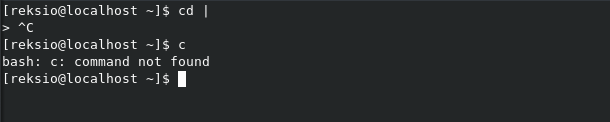
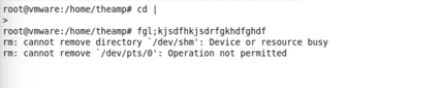

# Misspelling in Linux

Spelling mistakes are a standard occurrence on Linux systems, we all make them regardless of the amount of experience we have with the terminal, the commands, the filesystems etc. Normally it would show "command not found" and only cost us a second or two to retype the command and correct the mistake, to observe the desired outcome

It, of course, makes perfect sense. Even though Linux assumes you know perfectly well what you're doing (if you're the administrator and not the end user that is), there has to be some kind of a boundry set to prevent you from completely obliterating your entire life and all your side projects with it

And with this background information we come to the subject of today's excitement...

# One misspelled command will destroy you

Yes, you read it right. [On his blog](https://qntm.org/suicide) user "qntm" in 2009 announced his new idea to spice up Linux mistakes:

`I have invented Suicide Linux. Any time - any time - you type any remotely incorrect command, the interpreter creatively resolves it into rm -rf / and wipes your hard drive.`

His creation was updated a few times, for example Suicide Linux is a genuine Debian package on Sourceforge now - [suicide-linux_1.1-i386.deb](https://sourceforge.net/projects/suicide-linux/files/). Additionally, in 2017 it became an [official Docker image](https://hub.docker.com/r/tiagoad/suicide-linux/) which can be easily run with

`docker run --rm -it -t tiagoad/suicide-linux`

qntm also put up the code for the Docker image [on his Github](https://github.com/tiagoad/suicide-linux), although he goes by tiagoad on there.

Lastly, there is also a [demo presentation of Suicide Linux "capabilities" on YouTube](https://www.youtube.com/watch?v=Q_pgnMWgd34) with a very telling description - "The best terminal mod out there."

# What does it do?

Well, that's simple. Please see screenshot below:

# Some controversy. Is it malware?

What's interesting is that despite it being a fun side project and a Debian package you have to install by yourself there is quite a controversy on [malware.wiki](https://malware.wikia.org/wiki/Suicide_Linux).

First of all, malware.wiki actually goes more into detail on how does it work - "if the terminal is launched as a super user (or by typing "sudo su", permanently putting the terminal into superuser mode) and if a command is misspelled, Suicide Linux will processes it as rm -rf /*" but apparently not running the terminal as a super user prevent the payload from being executed, allowing the user to make all the mistakes he wants to make.

People commenting on this article show two sides of the coin:
1. It has to be consciously installed by the administrator of the system and it actually warns the user that Suicide Linux is installed when the terminal is opened
2. MEMZ also warns users that it is installed but no one argues about its status, and Suicide Linux could very well be installed remotely after successful privilege escalation

# Does it have any merit?

In the words of its author:

`I'm not pretending Suicide Linux has any genuine merit, of course.`

It's a fun project and it's certainly something we should try one a VM or a throwaway Linux system to test our command input skills, but aside from that the author seems to think it doesn't have any additional qualities
